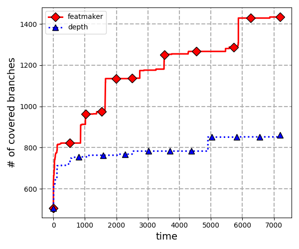

# FeatMaker

FeatMaker is a tool that generates a fully automated search strategy for symbolic execution, utilizing machine-tuned state features. Our paper of accepted version is available in this repository, [accepted_paper.pdf](accepted_paper.pdf).

## Installation
We recommend using a Docker image for quick and easy installation. To install FeatMaker, please follow the instructions provided in [docker file](Dockerfile).
```bash
$ docker pull skkusal/featmaker
$ docker run --rm -it --ulimit='stack=-1:-1' skkusal/featmaker
```
## Benchmarks
In the docker image, all 15 benchmarks we used are installed in 'root/featmaker/benchmarks'. Details of Benchmarks are as follow:

## How to run FeatMaker
You can run a short experiment of FeatMaker with the following command in the 'root/featmaker' directory. There are two required parameters: 'pgm' (target program) and 'output_dir' (name of the experiment directory).
```bash
$ python3 run_featmaker.py --pgm find --output_dir short_test --total_budget 7200
```
We also provided two additional approaches: the original KLEE and a naive version of FeatMaker (with random weights and simply accumulated features). You can execute these experiments with following commands in the 'root/featmaker' directory:
```bash
# run naive
$ python3 run_featmaker.py --main_option naive --pgm find --output_dir short_test --total_budget 7200
# run original KLEE
$ python3 run_depth.py --pgm find --output_dir short_test --total_budget 7200
```
If you want experiment with same setting as in our paper, you can use the follwing commands with default options.
```bash
# run featmaker
$ python3 run_featmaker.py --pgm find --output_dir test
# run naive
$ python3 run_featmaker.py --main_option naive --pgm find --output_dir test
# run original KLEE
$ python3 run_depth.py --pgm find --output_dir test
```
For more details about the options, you can use the following commands:
```bash
$ python3 run_featmaker.py --help
Usage: run_featmaker.py [options]

Options:
  -h, --help            show this help message and exit
  --pgm=PGM             Benchmarks : combine, csplit, diff, du, expr, find,
                        gawk, gcal, grep, ls, make, patch, ptx, sqlite,
                        trueprint
  --output_dir=OUTPUT_DIR
                        Result directory
  --total_budget=TOTAL_TIME
                        Total time budget (sec) (Default: 86400 = 24h)
  --small_budget=SMALL_TIME
                        small time budget (sec) (Default: 120)
  --n_scores=N_SCORES   The number of score functions in one iteration
                        (Default: 20)
  --main_option=MAIN_OPTION
                        Main task to run : featmaker or naive (Default:
                        featmaker)
```
The results will be saved in the 'featmaker_experiments/{output_dir}/{pgm}' directory. FeatMaker generates 4 main outputs.
1. test-cases : 'results/iteration-\*/\*.ktest' files
2. features : 'features/\*.f' files
3. weights : 'weights/iteration-\*/\*.w' files
4. Error cases : 'results/error_inputs' file

## Visualizing results
For visualizing results, we provided 'result_analysis.py'. You can generate a time-coverage graph, 'coverage_figure.pdf', and a bug table, 'bug_table.md', with a simple command:
```bash
$ python3 result_analysis.py
```

```bash
$ cat bug_table.md 
+-----------------------+-------------+---------+---------+
|     Bug location      |  featmaker  |  naive  |  Depth  |
+=======================+=============+=========+=========+
| ../../src/field.c 385 |      O      |    X    |    X    |
+-----------------------+-------------+---------+---------+
```
You can analyze results in different directories by modifying the 'data\_dict' dictionary in [result_analysis.py](./result_analysis.py). This dictionary uses data labels as keys and their corresonding stage locations as values.
```python3
data_dict = {
    # Example : "featmaker" : "/root/featmaker/featmaker_experiments/test/find"
    "featmaker" : "{Directory that featmaker result is stored}",
    "naive" : "{Directory that naive result is stored}",
    "depth" : "{Directory that depth result is stored}"
}
```
